# 🧼 Soap Calc

An installable, offline soap calculator for making soap at home — build and
compare recipes, size the lye and superfat, shape the soap's qualities, plan your
scent blend, and scale a batch to fit your mold. No accounts, no build step,
nothing leaves your device.

**Live:** https://phatbanana.github.io/Soap/ · **[Roadmap](ROADMAP.md)**

## Why

Soap recipes come from everywhere in mismatched units (grams, ounces, "half a
pound of this"), and every oil behaves differently with lye. Soap Calc lets you
enter your oils once and then convert, calculate, compare, and scale — on your
phone in the kitchen or on a desktop.

## Screenshots

<table>
  <tr>
    <td align="center" width="33%">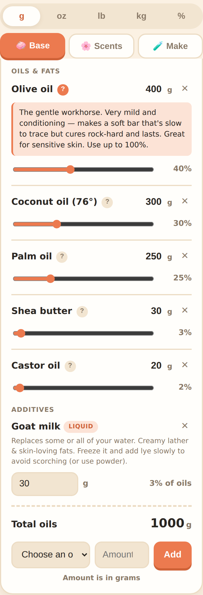<br><sub><b>Build a recipe</b> — oils with live %, per-oil descriptions</sub></td>
    <td align="center" width="33%">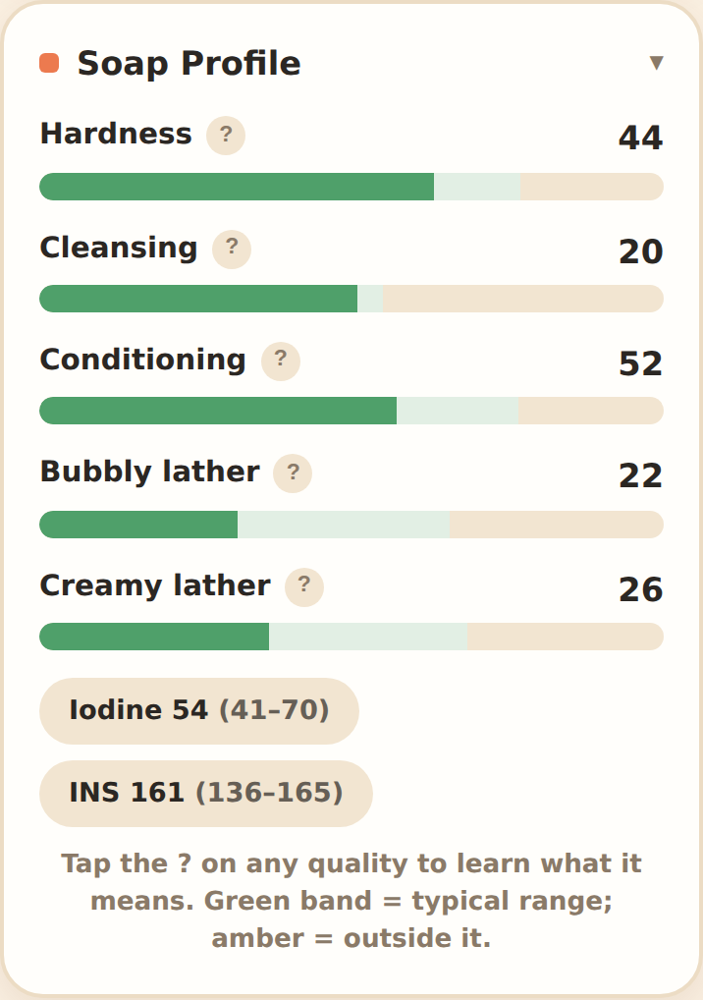<br><sub><b>Soap profile</b> — qualities vs recommended ranges</sub></td>
    <td align="center" width="33%">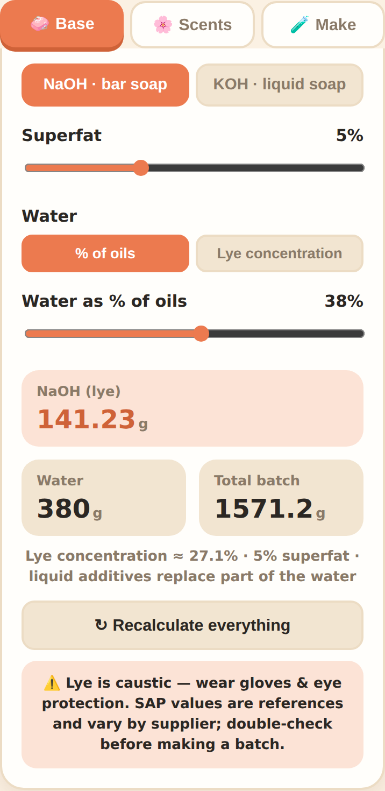<br><sub><b>Lye, superfat &amp; water</b> — two water methods</sub></td>
  </tr>
  <tr>
    <td align="center">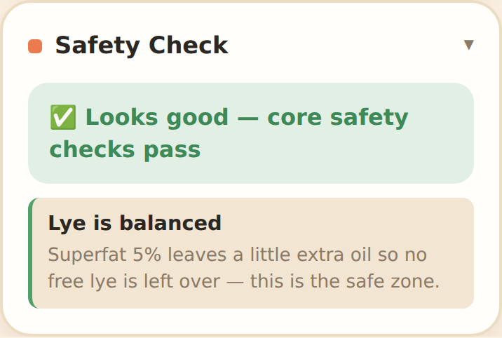<br><sub><b>Safety Check</b> — on-device pass / review / stop</sub></td>
    <td align="center">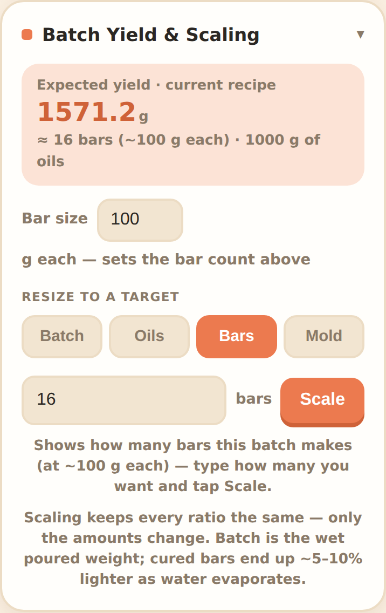<br><sub><b>Scale</b> — by batch, oils, bars or mold</sub></td>
    <td align="center">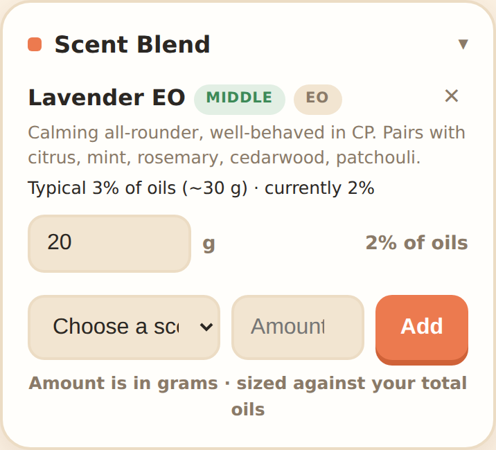<br><sub><b>Scents</b> — dosed &amp; capped to skin-safe</sub></td>
  </tr>
  <tr>
    <td align="center">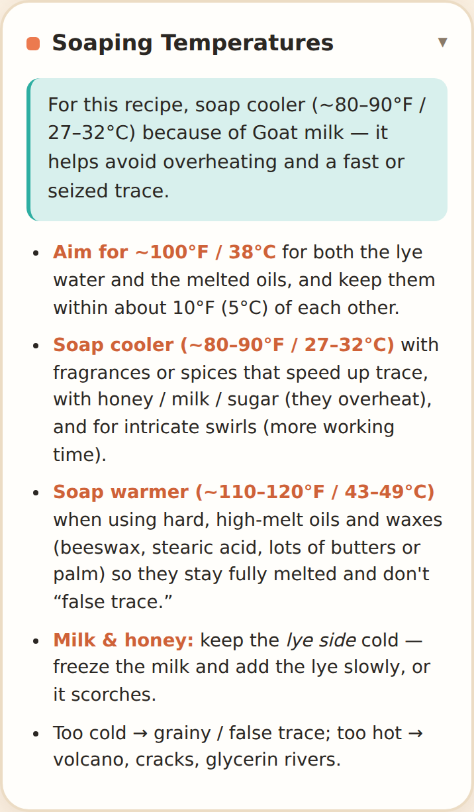<br><sub><b>Soaping temps</b> — context-aware, °F &amp; °C</sub></td>
    <td align="center">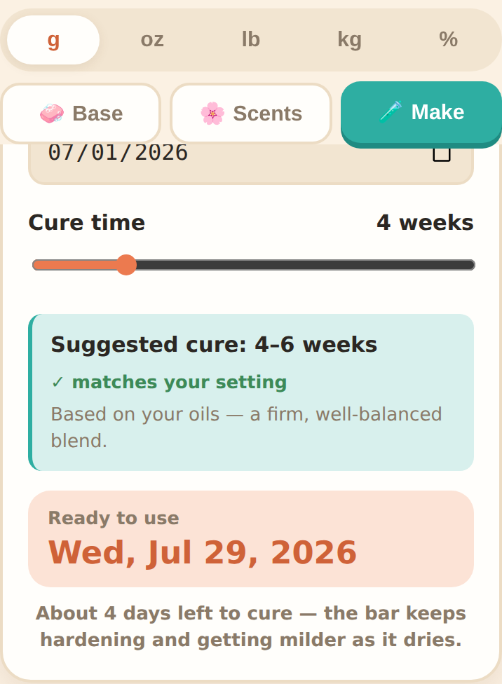<br><sub><b>Cure schedule</b> — with a suggested time</sub></td>
    <td align="center">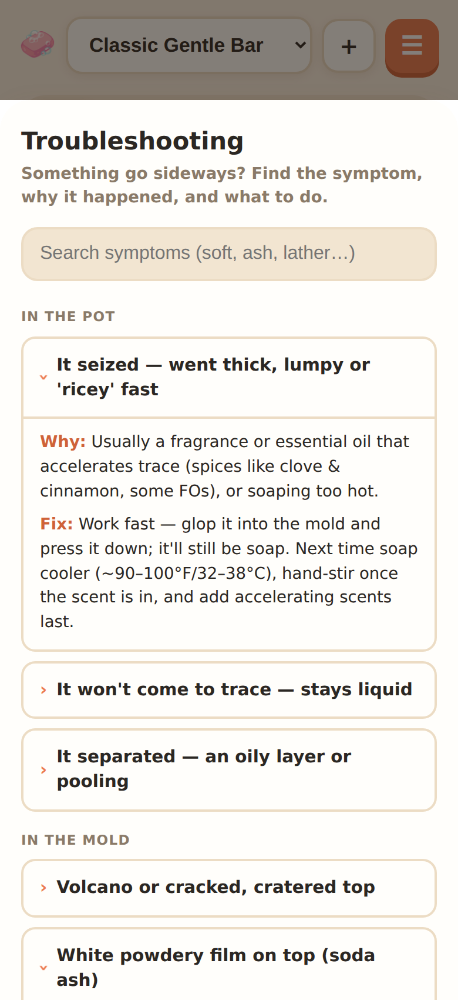<br><sub><b>Troubleshooting</b> — searchable "why did X happen?"</sub></td>
  </tr>
  <tr>
    <td align="center">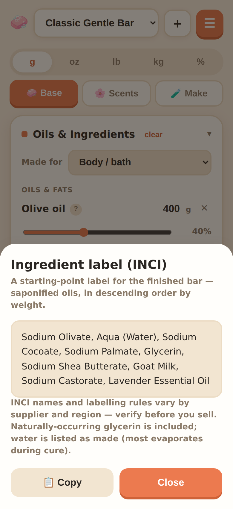<br><sub><b>INCI label</b> — saponified ingredient list</sub></td>
    <td align="center">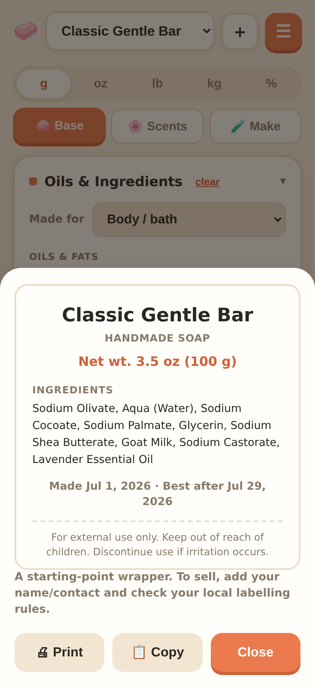<br><sub><b>Bar wrapper</b> — printable label for gifting</sub></td>
    <td align="center">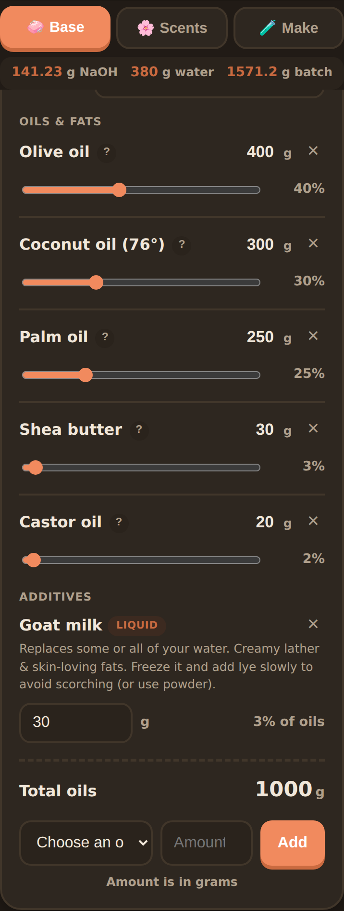<br><sub><b>Dark mode</b> — follows your device theme</sub></td>
  </tr>
  <tr>
    <td align="center">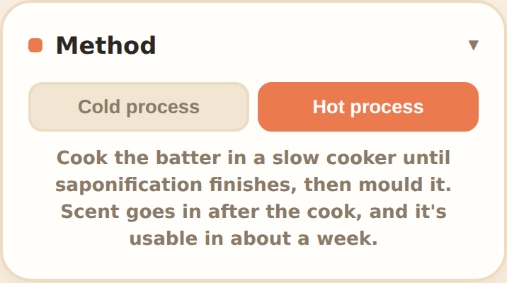<br><sub><b>Method</b> — cold or hot process</sub></td>
    <td align="center">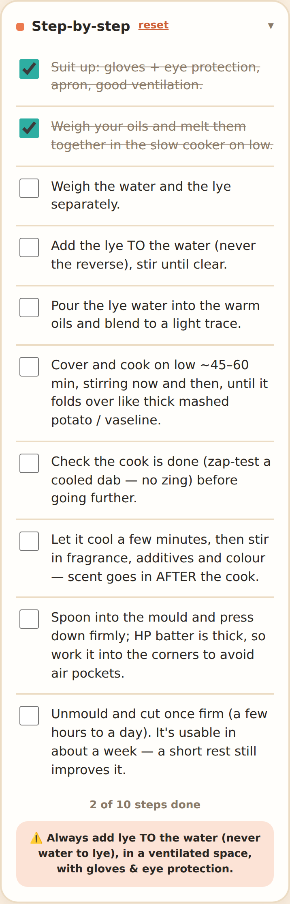<br><sub><b>Hot process</b> — its own checklist &amp; temps</sub></td>
    <td align="center">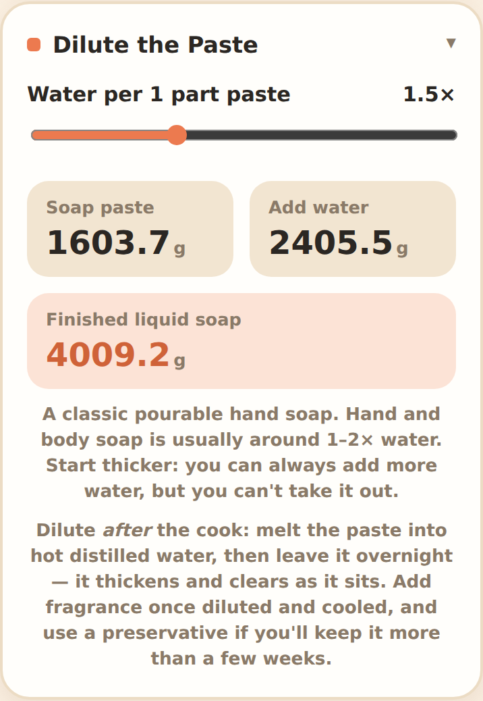<br><sub><b>Dilution</b> — KOH paste → liquid soap</sub></td>
  </tr>
  <tr>
    <td align="center">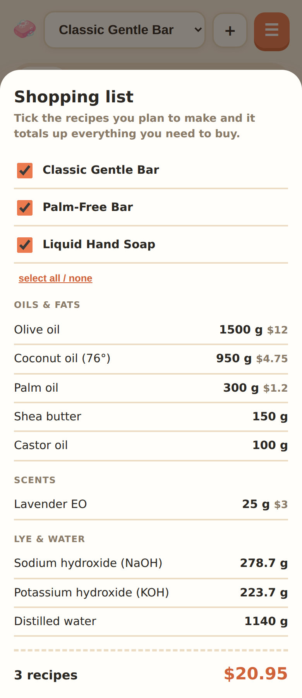<br><sub><b>Shopping list</b> — totals across several recipes</sub></td>
    <td align="center">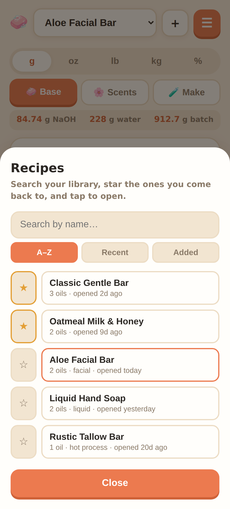<br><sub><b>Library</b> — search, sort &amp; favourites</sub></td>
    <td align="center">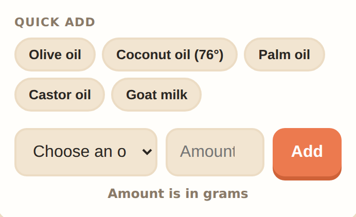<br><sub><b>Quick add</b> — your recent ingredients, one tap</sub></td>
  </tr>
</table>

## Features

### Recipe & units
- Enter oils/ingredients once and **switch the whole recipe between g / oz / lb /
  kg / %** from the compact unit picker in the app bar. The **%** view shows each oil
  as a share of total oils — unit- and batch-independent, the fairest way to compare
  recipes.
- **~40 oils, butters & fats** plus **18 additives**, focused on what a normal
  person can actually buy (grocery, pharmacy, craft store, Amazon) — olive,
  coconut, palm, castor, shea/cocoa/mango/kokum butters, sweet almond, avocado,
  sunflower (incl. high-oleic), canola, safflower, grapeseed, rice bran, sesame,
  soybean / "vegetable oil", corn, peanut, walnut, flaxseed, wheat germ, pumpkin
  seed, hemp, rosehip, jojoba, lard, tallow, vegetable shortening, beeswax,
  stearic acid, and more. Custom oils are allowed too (flagged, and left out of
  the lye/quality math).
- **Quick add** — the ingredients you've been using appear as one-tap chips above the
  picker, so a repeat oil is a tap and an amount instead of hunting through the list.
- **Every oil explains itself** — tap the **?** next to any oil for a plain-language
  note on what it brings (hardness / cleansing / conditioning / lather), its standout
  trait, and a typical usage %, so you know whether to use it. The same description
  previews under the picker the moment you select an oil, before you add it.
- **Additives** handled correctly (they don't go through the lye math): goat &
  coconut milk, honey, sugar, salt, aloe, brewed coffee & grounds, sodium lactate,
  oatmeal, kaolin & bentonite clay, activated charcoal, silk, glycerin, vitamin E,
  titanium dioxide, and mica — each with a usage note.

### Lye, superfat & water
- Lye computed **per oil** from its SAP value, reduced by your **superfat**, for
  **NaOH** (bars) or **KOH** (liquid soap, with purity).
- **Superfat, two ways (hot process)** — as a **lye discount** (the usual way: some oil
  is left unsaponified, but you don't get to choose which fats), or **added after the
  cook**: pick an oil to hold back and it's reserved for stirring in at the end, so you
  know exactly what's superfatting the bar. The lye is then sized to fully saponify
  only what goes in the pot — which genuinely differs from a flat discount whenever the
  held-back oil's SAP isn't the blend average. The hold-back also appears in the
  hot-process checklist, on the step where you'd actually do it.
- **Water, three ways** — set it as a **% of oils** (the traditional way, default
  38%), by **lye concentration** (the modern way, default 33%), or as a
  **water : lye ratio** (the old-school "2:1" notation you'll see in older recipes
  and other calculators). The last two size the water *from the lye* — so your
  superfat, which lowers the lye, lowers the water too. The panel always shows the
  numbers you aren't setting, plus the **total batch weight**. Water doesn't stay in the bar — most evaporates
  during cure — so this is really a **choice of how concentrated the lye is**: more
  water = thinner trace and more working time; less = faster trace and a firmer bar
  sooner.
- **Liquid soap dilution** — KOH soap is cooked to a paste and then thinned with
  water, so for a KOH recipe a **Dilute the Paste** card works out how much water to
  add: set how many parts water per part paste (0.25×–4×) and it shows the **paste
  weight**, the **water to add**, and the **finished volume of liquid soap**, with a
  hint on what that thickness feels like and the usual range for hand soap vs dish or
  shampoo.
- A **↻ Recalculate everything** button re-runs the whole calculation on demand
  (the app already recomputes live on every change — this is a one-tap "make sure
  every number is current").

### Soap profile & shaping
- Hardness, Cleansing, Conditioning, Bubbly & Creamy lather, plus Iodine and INS,
  computed from each oil's fatty acids and shown against recommended ranges — tap the
  **?** on any quality for a plain-language explanation of what it means.
- **Shape it:** drag per-oil sliders, or tap **Harder / More moisturizing / Better
  lather / Gentler** to nudge the blend live.
- **Context-aware Recipe Notes** react to your blend (soft/brittle bars, drying
  cleansing, DOS-prone oils, high castor, milk/honey handling, and more) — and to
  the **intended use**: pick *Body / Facial / Shampoo / Shaving / Dish / Laundry*
  in the **Made for** selector and the advice retunes. Dish and laundry soaps want
  high cleansing and ~0% superfat (no "drying" warning — that's the point), facial
  bars get a gentler cleansing cap, shampoo bars get an acid-rinse tip, and so on.

### Safety check
- A **Safety Check** card turns the numbers into a plain **pass / review / stop**
  verdict, all computed **on-device** (works on every phone, offline, instantly):
  it flags a missing lye cushion (0% superfat on a skin bar), custom oils the lye
  math can't see, a too-high superfat (soft/rancid), a strong **or** over-diluted
  lye solution, any scent over its skin-safe max, a heavy overall scent load, and
  rancidity-prone (DOS) blends. It also catches classic beginner traps: a
  **very high coconut/lauric bar** that'll be harsh without a big superfat, a
  **salt bar** that needs a high superfat and to be cut warm, a **fast-tracing**
  recipe (beeswax, stearic, spice oils) that can seize, and **skin-irritant
  essential oils** (cinnamon, clove, lemongrass) to keep low and patch-test. It
  also sanity-checks the **scale**: a batch too small to weigh the lye safely or
  too large to handle, a **nearly single-oil** recipe that looks like a missed oil
  or mistyped amount, and an **additive dosed like an oil** (a common grams-vs-
  teaspoons slip).
- **Optional AI explainer** — where your browser has a built-in on-device model
  (e.g. Chrome's Prompt API / Gemini Nano), a **✨ Explain in plain language**
  button rephrases the findings into a friendly summary. It runs entirely on your
  device, and the **verdict always stays the rule-based one** — the AI only
  explains, it never decides. On browsers without it, the button simply doesn't
  appear; the safety check itself always works.

### Batch yield & scaling
- **Expected yield** readout for the current ingredients (batch weight + approx.
  bar count), with a **bar weight saved per recipe** (it's a property of your mould,
  so switching recipes doesn't carry the wrong bar size into the bar count, cost per
  bar, wrapper net weight or the *Bars* scale target) — plus an **after-curing estimate**,
  since most of the water evaporates and bars come out meaningfully lighter than the
  wet poured weight.
- **Round to tidy amounts** — scaling leaves you with 793.83 g of olive oil, which
  nobody weighs out; one tap snaps every ingredient to a practical step for the unit
  you're in (whole grams, 0.1 oz…) and the lye recomputes from the new amounts.
- **Scale** the whole recipe (keeping every ratio) to hit a target **wet (poured)
  batch weight**, **total oils**, a **number of bars**, or a **mold size**. The
  weight target has its **own unit picker** (g / oz / lb / kg), so you can say "make
  10 lb" even while the rest of the app is in grams; or switch to **Bars** and say
  "make 24 bars" and it sizes the batch to that many bars at your bar weight.
- **Mold shapes:** size to a **loaf / box** (L×W×H), a **round / column** mold
  (diameter × height), or a **cavity** mold (number of cavities × mL each) — in
  inches or cm — and it estimates the oils that mold holds and scales to fit.

### Scents
- A separate list & receipt for **fragrance / essential oils**, dosed by usage
  rate, with a **scent-load** read-out (~3% sweet spot) and a **note pyramid**
  (top / middle / base balance).
- **Set recommended amounts** sizes the whole blend to a safe ~3% of oils, split
  by each oil's typical rate and **capped at each scent's skin-safe maximum**, so
  bars aren't over- or under-scented. Individual scents over their max are flagged.
- **Context-aware blending notes** based on the scents you're actually using —
  anchoring advice, trace accelerators, discoloration, and skin-safety cautions.

### Make it (process & cure)
- **Cold process or hot process** — pick the **Method** and the whole tab retunes.
  *Cold process* mixes at low temperature and saponifies in the mould. *Hot process*
  cooks the batter in a slow cooker: the checklist becomes the HP one (cook until it
  folds like mashed potato → zap-test → **scent in after the cook** → spoon and press
  into the mould), the temperature guide switches to cook temperatures, and the cure
  suggestion compresses to about **1–2 weeks** because saponification already finished
  in the pot.
- A **Make** tab with a **step-by-step checklist** (suit up → measure → mix lye →
  combine at temp → add scent → pour → unmold → cure), with your progress
  saved per recipe.
- A **cure schedule**: set the date you made the batch and the cure time, and it
  shows the **ready-to-use date** and days remaining.
- **Soaping-temperature guide** — a quick reference (aim ~100°F/38°C, when to soap
  cooler vs warmer, milk/honey cautions), plus a **context-aware tip** that adapts to
  your recipe: warmer for high-melt fats (beeswax, stearic, lots of butters), cooler
  for accelerators (honey, milk, spice oils), in both °F and °C.
- **Batch notes** — a free-text field on the Make tab to keep a per-recipe log
  (traced fast, great lather, use less water next time…). Saved with the recipe and
  kept private — it's never included when you share a recipe by link.
- **Batch history** — tap **Log this batch** and the date, lot, cure time and notes are
  filed into a per-recipe history, then the checklist clears for your next make. Every
  make is kept, so remaking a recipe never overwrites what happened last time, and the
  library shows how many times you've made each one.
- **Troubleshooting reference** — a searchable "why did my soap do X?" guide grouped
  by stage (in the pot / in the mold / curing & storing / using the bar): seizing,
  soda ash, overheating, DOS, soft or crumbly bars, poor lather, and more — each with
  the likely cause and the fix.
- **Suggested cure time from your oils** — softer, olive/oleic-heavy bars cure
  slower and harder coconut/palm/butter bars cure faster, so the app suggests a
  week range from the blend's hardness (e.g. a hard bar ~3–4 weeks, a balanced bar
  ~4–6, a true castile ~8–12 and improving for months), nudged for water content.
  One tap applies it.

### Costs & shopping
- Enter each ingredient's **price per kg** (saved and reused across recipes) and
  see the **batch total** and **cost per bar**, in your chosen currency.
- 🛒 **Shopping list** — tick the recipes you plan to make and it totals everything
  you need to buy: each oil, additive and scent **summed across all of them**, plus
  the **NaOH and KOH kept separate** (they're different chemicals) and the total
  distilled water. Priced ingredients show a line cost and an **estimated total**, and
  the whole list is copyable to take to the shop.
- 📦 **Inventory** — record what's in the cupboard and the shopping list only asks you
  to buy **what you're actually short of**: each line shows *need · have → buy*,
  anything you have enough of is greyed out, and the total counts only the shortfall.
  The Inventory screen also answers "**can I make this today?**" for the current
  recipe, and **logging a batch draws down** what it used. Entirely optional — track
  nothing and the shopping list behaves exactly as it always has.

### Recipes
- **15 built-in example recipes** — one-tap starters across **bars** (Classic Gentle
  Bar, Pure Castile, Bastille, Luxury Butter Bar, Palm-Free Bar, Old-Fashioned Tallow
  Bar, Coconut Salt Spa Bar, Shaving Bar), **liquid soap** (Liquid Hand Soap, Liquid
  Castile, Liquid Shampoo), **dish** (Liquid Dish Soap, Solid Dish Block) and
  **laundry** (Laundry Bar, Palm-Free Laundry Bar). Loading one adds it as a saved
  recipe you can tweak.
- **Saved, named recipes** — keep a library (New / Duplicate / Rename / Delete) and
  switch between them; each is stored separately in your browser.
- **Library browser** — **All recipes** in the ⋯ menu opens a searchable list: filter
  by name, sort **A–Z / Recent / Added**, and **star** the ones you keep coming back
  to. Favourites pin to the top of both the list and the recipe picker (marked ★), and
  each row shows a quick read — how many oils, whether it's liquid or hot process, what
  it's made for, and when you last opened it.
- **Compare** any two recipes side by side (oils as % of oils, plus qualities,
  lye, and batch).
- **Recipe card** — a clean **printable / copyable** summary to take to the bench
  or text to someone.
- **Ingredient label (INCI)** — generates a finished-bar ingredient list for gifting
  or selling: oils shown as their **saponified salts** (e.g. *Sodium Olivate, Sodium
  Cocoate*, or *Potassium …* for liquid soap), plus water, naturally-occurring
  glycerin, additives and fragrance, in descending order by weight — copyable, with
  custom oils flagged. (INCI names and labelling rules vary by supplier/region —
  verify before sale.)
- **Bar wrapper** — a **printable / copyable** label to wrap around a finished bar:
  soap name, net weight (the **cured** estimate, not the wet weight — weigh a real bar
  before printing for sale), the INCI ingredient list, the made & ready dates, an
  optional **lot number** for traceability (one tap generates one from the batch date),
  and the standard cautions. A starting point for gifting or a market table (add your own
  name/contact and check local rules before selling).

### Get recipes in & out
- 📷 **Scan a photo** of a recipe — on-device OCR (Tesseract.js) reads it, then you
  confirm/fix the parsed lines. (First scan downloads the reader ~5 MB and needs
  internet once; after that it's cached.)
- 📄 **Import / export CSV** — `section,name,amount,unit`; import accepts mixed
  units (incl. tsp/tbsp/cup/drop) and matches names to the database.
- 🔗 **Share by link** — turn a recipe into a link you can text or paste. The whole
  recipe rides *inside* the link (nothing is uploaded); opening it adds the recipe
  to the other person's library. Works offline, no account.

### App & privacy
- 📱 **Installable PWA** — add to your home screen; works fully offline.
- **Responsive** — a compact single column on phones, a two-column layout on
  desktop.
- **Always-visible lye & batch** — a compact readout pinned under the tabs shows your
  lye, water and batch weight while you scroll a long ingredient list, so you can see
  the numbers move as you tweak.
- **Theme** — follows your device by default; tap **Theme** in the ⋯ menu to cycle
  auto → light → dark and force one.
- **Multi-level undo** — removing an ingredient, scaling, rounding, nudging or
  clearing can all be stepped back (up to 10 changes), and the Undo button shows how
  many are left.
- **Collapsible sections** — tap any card's header to fold or unfold it (the
  chevron shows the state), so a long recipe stays scannable; your choices are
  remembered, and the guidance-heavy cards (Recipe Notes, Shape the Profile) start
  folded.
- Everything is saved **locally in your browser** (localStorage). There's no
  server and no account — nothing is transmitted, and one person's recipes never
  reach another's browser.
- **Updates are automatic** — the service worker is network-first, so when you're
  online you always get the latest version (no need to clear the cache), and the
  cache is only an offline fallback. Cache updates never touch your saved recipes.
  A small **version + build date** at the very bottom of the page tells you which
  release you're looking at; **tap it** to drop the offline cache and reload the
  freshest copy if you ever suspect a stale one.
- **Your data is protected** — the app requests *persistent storage* so recipes
  aren't auto-evicted, and **Back up all data / Restore from backup** (in the
  recipe **⋯** menu) export/import everything as a JSON file — a safety net before
  clearing site data, and a way to move recipes between devices or browsers.

## Install on your phone
Open the live URL and:
- **Android / Chrome:** tap **Install** (in the app or the browser menu).
- **iPhone / iPad (Safari):** tap **Share → Add to Home Screen**.

## How the numbers work
- **Lye (NaOH):** `Σ(oil weight × oil SAP) × (1 − superfat%)`; KOH scales by 1.4027
  and divides by purity.
- **Water:** either a % of total oil weight (default 38%), or derived from the lye
  by **lye concentration** — `water = lye × (1 − c) / c` for concentration `c`
  (default 33%), so a higher superfat (less lye) also means less water.
- **Qualities:** weighted blend fatty-acid percentages (e.g. Hardness = palmitic +
  stearic + lauric + myristic).

**Reference SAP / fatty-acid values vary by supplier — always verify before a real
batch. Lye is caustic: wear gloves and eye protection.**

## Project layout
- `index.html` — app shell
- `app.css` — styles (incl. responsive + print)
- `data.js` — oil / additive / aroma database
- `app.js` — logic
- `manifest.webmanifest`, `sw.js`, `icons/` — PWA (installable + offline)
- `tests/` — behavior test suite
- `screenshots/` — images used in this README

Hosted free on GitHub Pages from `main`. There is **no build step** — the files
above are what ships.

## Tests
The app is plain HTML/CSS/JS, but the soap chemistry, safety checks, scaling and
localStorage persistence are covered by a headless-browser test suite that drives
the real app and asserts on the computed numbers and saved state.

```sh
npm install                       # installs playwright (dev-only)
npx playwright install chromium   # one-time browser download
npm test                          # runs tests/soapcalc.test.mjs
```

The suite is self-contained (it starts its own static server) and exits non-zero
on any failure — handy to run before pushing a change to the lye math, safety
rules, or persistence.

## What's next
See **[ROADMAP.md](ROADMAP.md)** for the full picture — everything the app does today,
what's planned next (a batch log, an ingredient inventory, hot-process superfat), and
what's deliberately *not* planned, with the reasoning.
